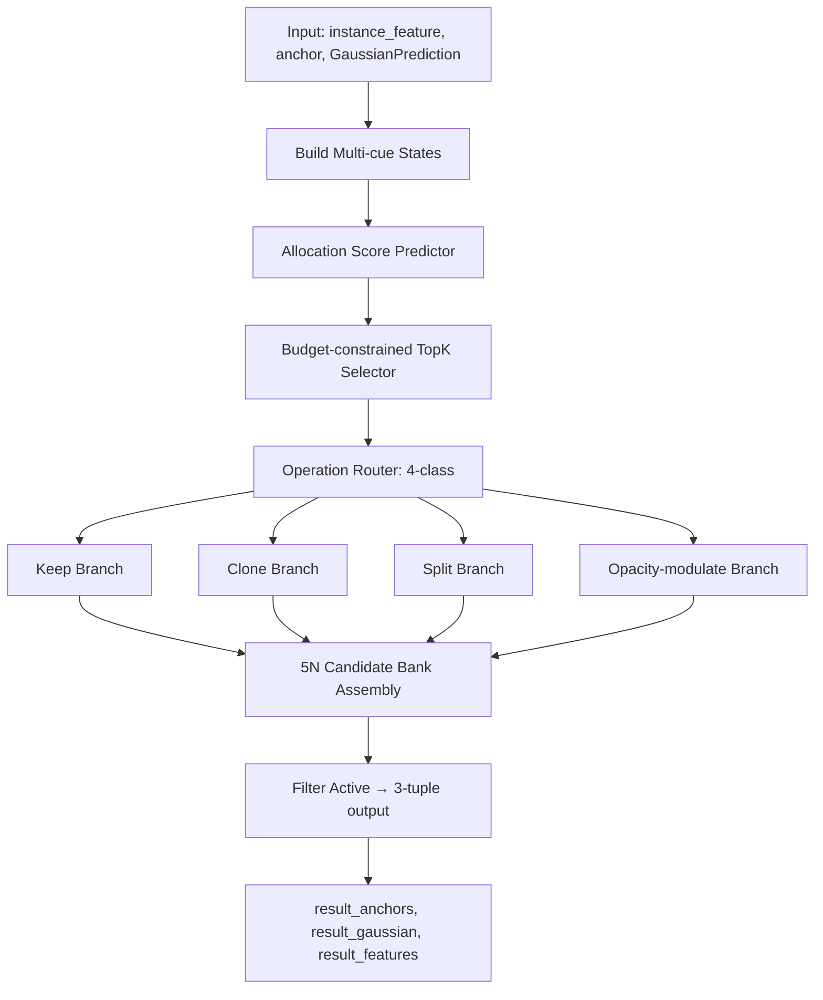

# AdaptiveAllocationV3 实现计划 (修订版)

## 1. 模块定位

根据 `allocationv3.md` 设计文档，实现 `AllocationV3` 模块，位于 `model/encoder/gaussian_encoder/topk_module/adaptive_allocationv3.py`。

## 2. 接口兼容性要求

根据用户反馈，**输出接口必须与 `adaptive_allocation.py` 保持一致**，以便 `GaussianOccEncoder` 无需修改即可复用。

### 统一的 forward 签名
```python
def forward(self, instance_feature, anchor, gaussian):
    # instance_feature: [B, N, E]
    # anchor:           [B, N, A]
    # gaussian:         GaussianPrediction (means, scales, rotations, opacities, semantics)
    ...
    return result_anchors, result_gaussian, result_features
```

### 统一的返回格式
- `result_anchors`: `[B, M, A]` (M = 实际生效的 Gaussian 数量)
- `result_gaussian`: `GaussianPrediction` 类型
- `result_features`: `[B, M, E]`

## 3. 与 `adaptive_allocation.py` 的关键差异

| 维度 | `adaptive_allocation.py` (现有) | `adaptive_allocationv3.py` (新) |
|---|---|---|
| Selection | 所有 N 个 Gaussian 都参与 | **Budget-constrained TopK**: 仅 TopK 进入 adaptive allocation |
| Operations | 3类: keep/clone/split | **4类**: keep/clone/split/**opacity-modulate** |
| State encoding | 仅 raw instance feature | **Multi-cue**: geometry + semantic + feature (coverage 可选) |
| 内部实现 | 动态拼接 (可变大小) | **5N fixed bank** + active mask 内部计算 |
| Gradients | Gumbel-Softmax | **Straight-through** (hard fwd + soft bwd) |
| Batch处理 | 逐 batch loop | 逐 batch loop (与现有保持一致) |
| 输出 | anchor + gaussian + features | **anchor + gaussian + features** (保持一致) |
| 输入 | instance_feature + anchor + gaussian | **instance_feature + anchor + gaussian** (保持一致) |

## 4. 模块架构



## 5. 文件结构

新增文件:
- `model/encoder/gaussian_encoder/topk_module/adaptive_allocationv3.py`

修改文件:
- `model/encoder/gaussian_encoder/topk_module/__init__.py` (新增 import)
- `model/encoder/gaussian_encoder/__init__.py` (新增 import 条目)

## 6. 详细实现步骤

### Step 1: Multi-cue Allocation State Encoding

从 `gaussian` 和 `instance_feature` 提取多源特征:

```python
# Geometry cues (从 scale 推导) - shape: [B, N, 6]
mean_scale = scale.mean(dim=-1, keepdim=True)
log_volume = torch.log(scale.prod(dim=-1, keepdim=True) + eps)
max_scale = scale.max(dim=-1, keepdim=True).values
min_scale = scale.min(dim=-1, keepdim=True).values
anisotropy_ratio = max_scale / (min_scale + eps)
geometry_cue = concat([scale, mean_scale, log_volume, anisotropy_ratio])  # [B, N, 6]

# Semantic cues (从 semantic logits 推导) - shape: [B, N, 3]
prob = semantic.softmax(dim=-1)
entropy = -(prob * (prob + eps).log()).sum(dim=-1, keepdim=True)
top2_prob = prob.topk(k=2, dim=-1).values
margin = top2_prob[..., 0:1] - top2_prob[..., 1:2]
confidence = top2_prob[..., 0:1]
semantic_cue = concat([entropy, margin, confidence])  # [B, N, 3]

# Allocation state encoding
z = concat([instance_feature, geometry_cue, semantic_cue], dim=-1)
h = state_encoder(z)  # [B, N, hidden_dim]
```

### Step 2: Allocation Score Predictor + Budget-constrained TopK

```python
allocation_score = torch.sigmoid(score_head(h))  # [B, N, 1]
K = max(1, int(allocation_ratio * N))
_, topk_idx = allocation_score.squeeze(-1).topk(K, dim=1)
selected_mask = torch.zeros(B, N, dtype=torch.bool, device=device)
selected_mask.scatter_(1, topk_idx, True)
```

### Step 3: Operation Router (4-class + Straight-through)

```python
KEEP, CLONE, SPLIT, ATTEN = 0, 1, 2, 3
op_logits = operation_head(h)  # [B, N, 4]
op_prob = op_logits.softmax(dim=-1)
op_id = op_prob.argmax(dim=-1)
op_id = torch.where(selected_mask, op_id, torch.full_like(op_id, KEEP))

# Straight-through: forward=hard, backward=soft
op_onehot_hard = F.one_hot(op_id, num_classes=4).float()
op_onehot = op_onehot_hard.detach() - op_prob.detach() + op_prob
```

### Step 4: Operation-specific Candidate Generation (per-batch loop)

参照 `adaptive_allocation.py` 的逐 batch 处理模式，每个 batch 内:

```python
for b in range(B):
    # 1. 提取当前 batch 的数据
    cur_feats = instance_feature[b]  # [N, E]
    cur_opa = opacities[b]           # [N, 1]
    cur_means = means[b]             # [N, 3]
    cur_scales = scales[b]           # [N, 3]
    cur_rots = rotations[b]          # [N, 4]
    cur_sems = semantics[b]          # [N, C]
    cur_anchor = anchor[b]           # [N, A]
    cur_h = h[b]                     # [N, hidden_dim]
    cur_selected = selected_mask[b]  # [N]
    cur_op_id = op_id[b]             # [N]

    # 2. 生成 5 个 slots 的 candidate bank
    
    # slot 0: keep (orig)
    keep_means = cur_means  # [N, 3]
    # ...
    
    # slot 1: clone child
    clone_child_means = ...  # [N, 3]
    # ...
    
    # slot 2: split pos child
    # slot 3: split neg child
    # slot 4: opacity-modulated
    
    # 3. Build 5N bank
    bank_means = stack([keep, clone, split_pos, split_neg, atten], dim=0)  # [5, N, 3]
    
    # 4. Build active mask
    # keep active: keep_mask | clone_mask
    # clone active: clone_mask
    # split active: split_mask (both pos and neg)
    # atten active: atten_mask
    
    # 5. Filter active gaussians and assemble output
    active_indices = where(active_mask)
    result_means = bank_means.reshape(5*N, 3)[active_indices]
    ...
```

### Step 5: Clone Branch (参照 allocationv3.md §10)

```python
clone_dir = normalize(clone_dir_head(h))               # [B, N_selected, 3]
clone_dist = sigmoid(clone_dist_head(h)) * mean_scale  # [B, N_selected, 1]
clone_scale_ratio = 0.7 + 0.3 * sigmoid(clone_scale_head(h))

mean_clone = mean + clone_dist * clone_dir
scale_clone = scale * clone_scale_ratio
rotation_clone = rotation
opacity_clone = opacity * sigmoid(clone_opacity_head(h))
semantic_clone = semantic + clone_semantic_head(h)
feature_clone = feature + clone_feature_head(h)
```

### Step 6: Split Branch (参照 allocationv3.md §11)

```python
# Split direction: geometry prior + learned direction
axis_dir = get_max_scale_axis(rotation, scale)       # [B, N, 3]
learned_dir = normalize(split_dir_head(h))           # [B, N, 3]
split_dir = normalize(axis_dir + learned_dir)

split_dist = sigmoid(split_dist_head(h)) * mean_scale
split_scale_ratio = 0.45 + 0.30 * sigmoid(split_scale_head(h))

mean_split_pos = mean + split_dist * split_dir
mean_split_neg = mean - split_dist * split_dir
scale_split = scale * split_scale_ratio
# ... 其他属性由 split 的 heads 生成
```

### Step 7: Opacity-modulate Branch (参照 allocationv3.md §12)

```python
m = m_min + (1 - m_min) * sigmoid(opacity_mod_head(h))
opacity_atten = opacity * m
# 其他属性保持不变
```

### Step 8: 5N Candidate Bank → Filter → 3-tuple Output

```python
# 5N bank assembled internally
# Filter to active gaussians
# Return (result_anchor, result_gaussian, result_features)
```

## 7. 类结构设计

```python
@MODELS.register_module()
class AdaptiveAllocationV3(BaseModule):
    def __init__(self,
                 feat_embed_dim=128,
                 semantic_dim=17,
                 pc_range=None,
                 scale_range=None,
                 unit_xyz=None,
                 hidden_dim=256,
                 allocation_ratio=0.4,
                 m_min=0.05,
                 use_straight_through=True,
                 **kwargs):
        # State encoder
        # Score head + Operation head
        # Clone heads (6 heads)
        # Split heads (6 heads × 2 children)
        # Opacity-modulate head
    
    def build_geometry_cue(self, scale)
    def build_semantic_cue(self, semantic)
    def _clone_branch(self, feats, gaussian, anchor, h)
    def _split_branch(self, feats, gaussian, anchor, h)
    def _atten_branch(self, feats, gaussian, anchor, h)
    def _assemble_bank(self, ...)  # 5N bank → filter → output
    def forward(self, instance_feature, anchor, gaussian)
```

## 8. 各操作的 Candidate 输出规则

| 操作 | slot 0 keep | slot 1 clone | slot 2 split_pos | slot 3 split_neg | slot 4 atten | 净增减 |
|---|---|---|---|---|---|---|
| KEEP | ✅ | ❌ | ❌ | ❌ | ❌ | +0 |
| CLONE | ✅ | ✅ | ❌ | ❌ | ❌ | +1 |
| SPLIT | ❌ | ❌ | ✅ | ✅ | ❌ | +1 |
| ATTEN | ❌ | ❌ | ❌ | ❌ | ✅ | +0 |

## 9. 测试验证

1. 创建测试脚本验证前向传播
2. 检查输出格式与 `adaptive_allocation.py` 一致
3. 检查 TopK 选择数量是否正确
4. 检查各操作的 candidate 数量
5. 检查 active mask 是否正确反映操作路由

## 10. 注意事项

1. **多卡训练稳定性**: 内部 5N bank 保证固定 shape，最终输出过滤后可能有不同长度，需做 padding
2. **避免 GT leakage**: coverage cue 不用于初始版本，后续可扩展
3. **Hard routing 梯度**: 使用 straight-through trick
4. **Boundary clamping**: 与 `adaptive_allocation.py` 一致使用 `boundary_margin=0.1`
5. **Split 方向**: 使用 `get_max_scale_axis` 结合 learned direction
